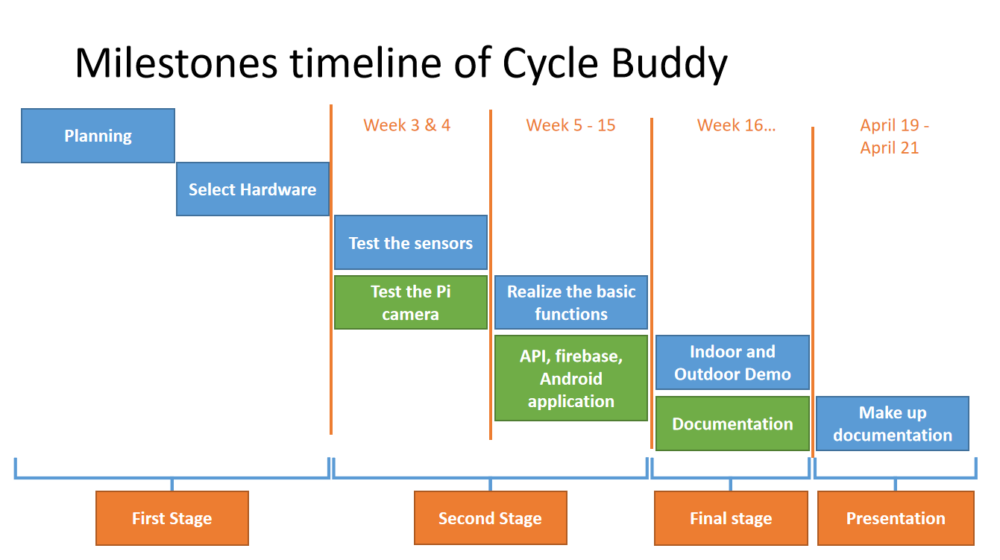

       
    
      
    </a>

* In the first stage, we make a plan to decide what to do for the project and which type of sensors we should choose.   
* In the second stage, we test the sensors and finish the unit test for Hall sensor, ultrasonic sensor and Pi camera, which we select to use in the project.   
* In the final stage, we spend a lot of time realizing and intergrating the functions, and link them to the API, firebase and our Android Application.   
* Finally, we record the indoor and outdoor demo for our project and make up the documentation for our presentation.   
