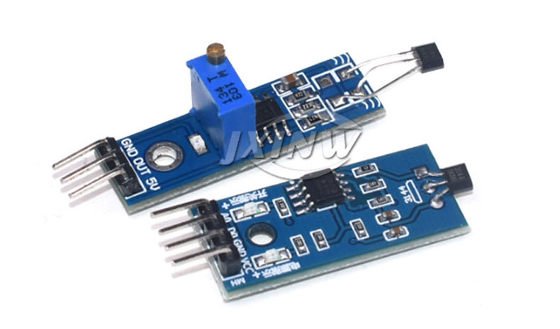
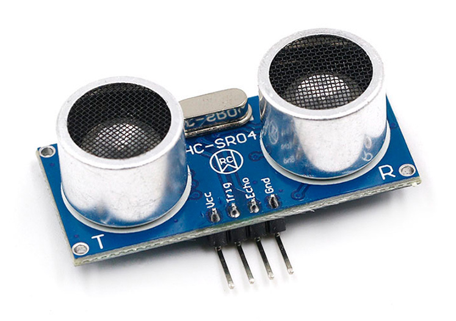
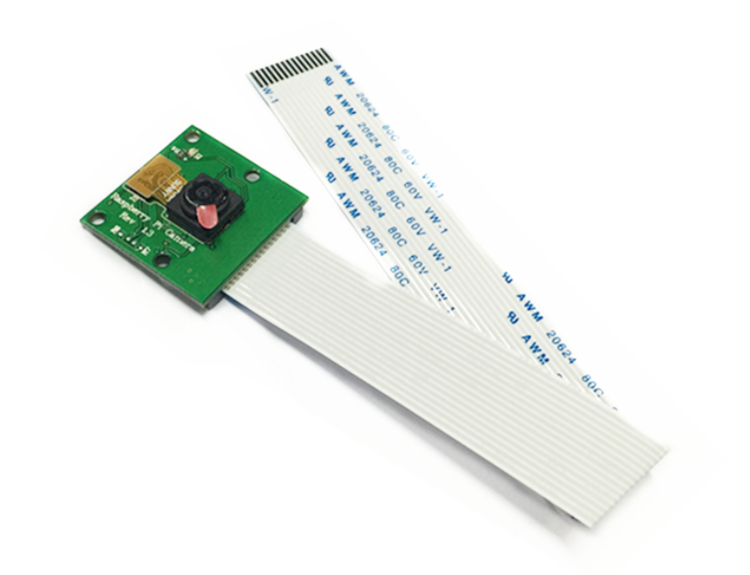
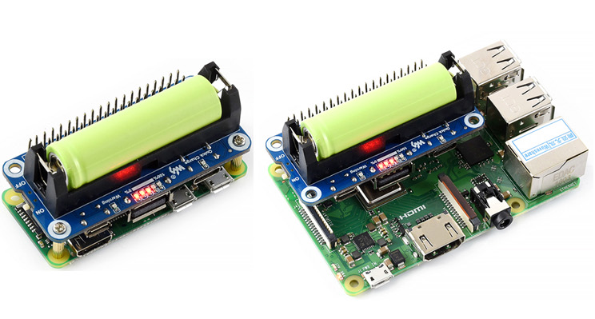
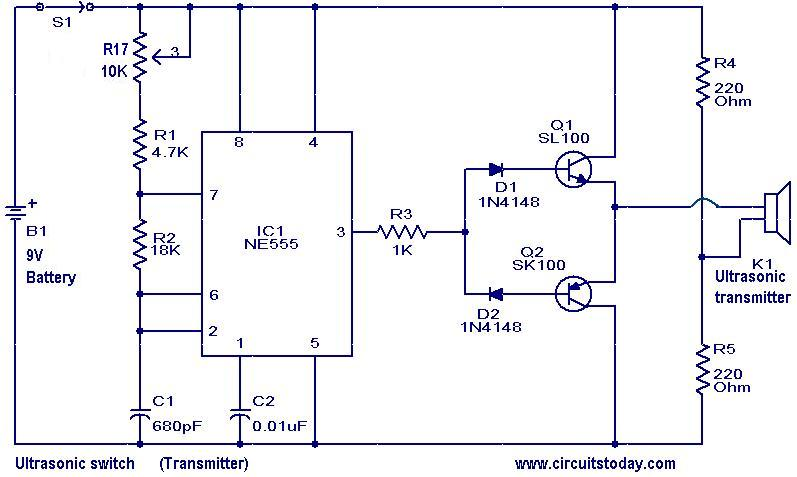
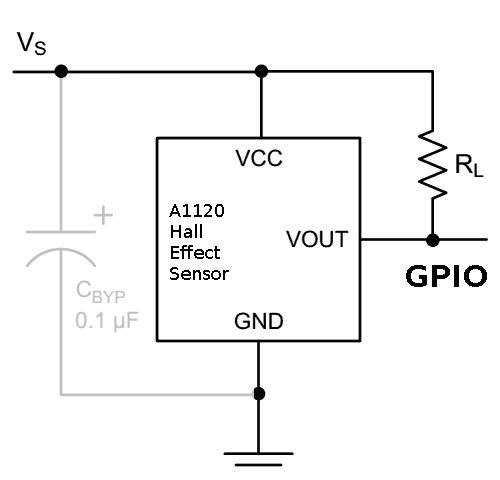

## Hardware module
### Main device:
* [Raspberry Pi 3 Model B +](https://thepihut.com/products/raspberry-pi-3-model-b-plus?src=raspberrypi) (￡33.90, **1** is needed, not included)

  ​	The Raspberry Pi 3 Model B is the earliest model of the third-generation Raspberry Pi. In our project, It can receive the real-time signals of the GPIO from all the sensors and deal with the real-time data.

### Sensors:
* [Hall sensor](https://www.amazon.co.uk/AZDelivery-Linear-Magnetic-Sensor-Arduino/dp/B07DPVTKBB/ref=sr_1_4_sspa?dchild=1&keywords=Hall+Effect+Sensor&qid=1618406619&sr=8-4-spons&psc=1&spLa=ZW5jcnlwdGVkUXVhbGlmaWVyPUEyV1lEMzJNSUE5S1A4JmVuY3J5cHRlZElkPUEwMjc5ODE1MTI4TUc5SFI1R0gxUSZlbmNyeXB0ZWRBZElkPUEwMDIzNjQwMTkzSk03UDI4WFdROSZ3aWRnZXROYW1lPXNwX2F0ZiZhY3Rpb249Y2xpY2tSZWRpcmVjdCZkb05vdExvZ0NsaWNrPXRydWU=) (￡4.49, **1** is needed)

  

    
          
    <b>Hall sensor</b>    
  

  
  ​	We use a hall sensor to detect the velocity of the bike. The theory is to put the magnets On the axle of the bicycle wheel. Make sure the hall sensor is close to magnets enough so that it can detect the magnetic field when the bike runs.

* [Ultrasonic sensor](https://www.amazon.co.uk/HC-SR04-Ultrasonic-Distance-Measuring-Arduino/dp/B01DM8MRTS/ref=sr_1_7?dchild=1&keywords=Ultrasonic+Sensor&qid=1618407336&sr=8-7)（￡3.99,  **1** is needed)
  
  

    
          
    <b>Hall sensor</b>    
  

  
  ​	The Ultrasonic sensor is to detect the distance between the bicycle and car. Besides, according to the velocity of the bicycle, it can calculate the velocity of the car. 

* [Pi camera](https://www.amazon.co.uk/dp/B07XBKC6H7/ref=cm_sw_r_u_apa_glt_fabc_74TKMY2AH1HFZ4SVKC7J) （￡10.99, **1** is needed) 
 
 

    
          
    <b>Pi camera</b>    
  

  
  ​	The Pi camera is to capture the picture of the car, especially capture the license plate number of the car. We find a feasible location for the Pi camera so that the 

### Other auxiliary tools :

* Male/Male, Female/Female and Male/Female wires ，magnets (approximately ￡ 2.34)
* GPIO Breakout Kit Expansion Board For Raspberry Pi 3 B+ (￡14.49)
* Power supply for Raspberry Pi or Power bank. (￡ 13.56)
  
  

    
          
    <b>Power battery</b>    
  

   

​	**Overall**, it costs us ￡49.86 except the **Raspberry Pi 3 Model B +** for the project.
   

## How does the hardware work? 

* Ultrasonic Sensor: The latter aims at capturing the distance from the car relative to to the bike. Moreover, it will extract the speed at which the car was coming at with cm/s as units.  

  

    
          
    <b>Ultrasonic sensor circuit</b>    
  

  
* Hall Effect Sensor: This sensor will enable the system to know when the bike is rotating, giving us its velocity with cm/s as units. This is needed to understand if the car is parked or not. We would not want to blame a driverless car.  
  
  

    
          
    <b>Hall sensor circuit</b>    
  

  
* Pi Camera: Once the camera is triggered, it will be situated strategically to ensure it captures the driver's car plate. Once done, the system will send the captured image to an API that will recognise the car plate using Computer Vision.  

