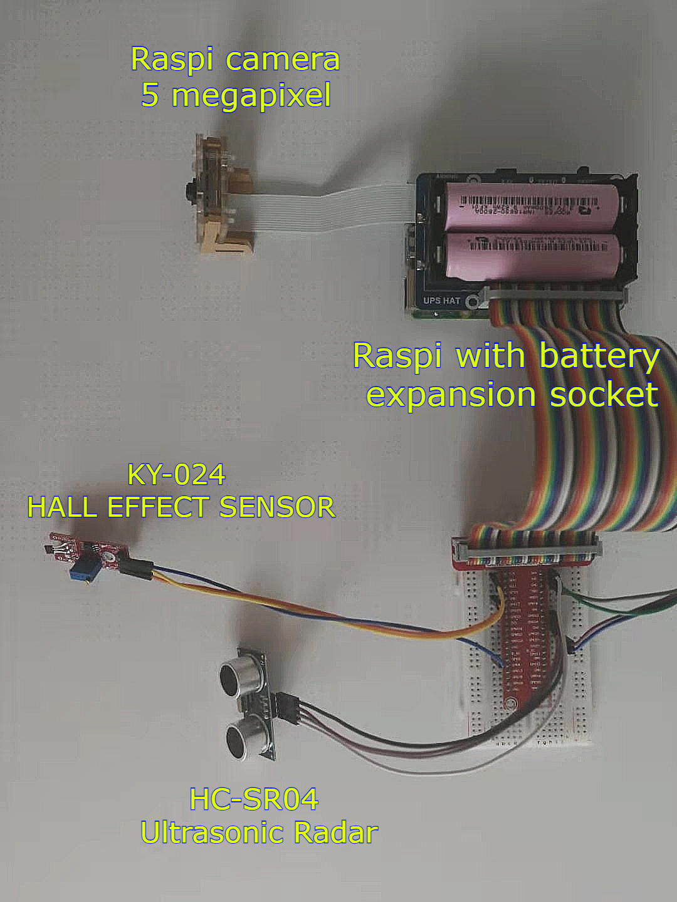
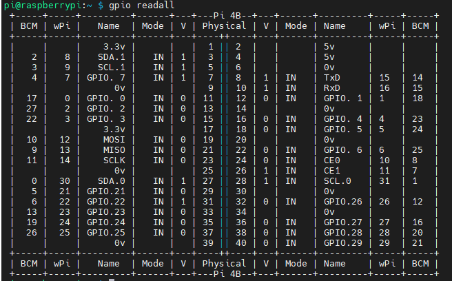

## Hardware connection
 

  
    
  <b> Circuits </b>    

 

  
    
  <b> Hardware connection </b>    

 

* This hardware connection is for **Raspberry Pi 4B**, if you do not use this type, you should connect GPIO according to your version.
