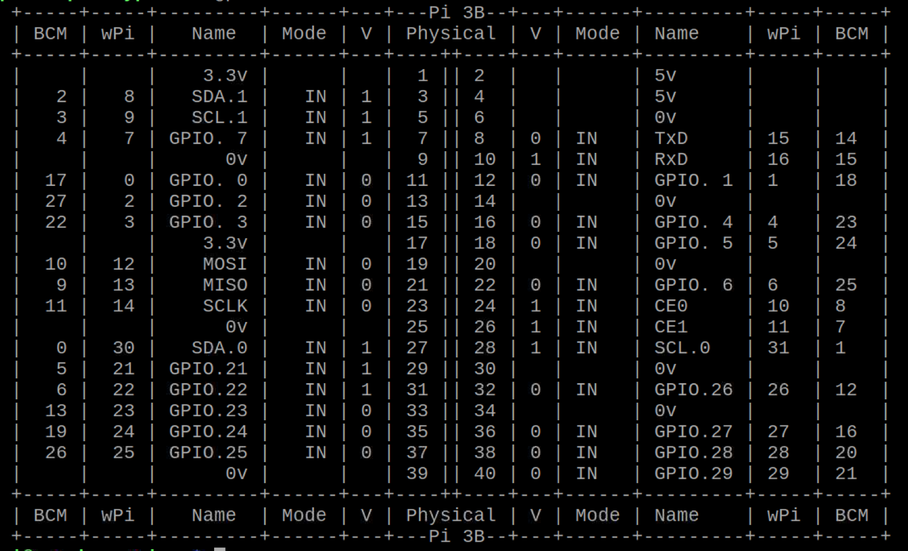

## Hardware connection
 

  
    
  <b> Circuits </b>    

 

### Hardware connection for Raspberry Pi 3B 

  
    
  <b> Hardware connection for Raspberry Pi 3B </b>    

 

Raspberry Pi 3B，GPIO and wiringPi pin usage defination, required to be modified given different GPIO layout:   
**#define HALL 0  
#define SONAR 1  
#define pinInHall 1  
#define pinOutHall 4  
#define pinInSonarOne 24  
#define pinOutSonarOne 23**  

### Hardware connection for Raspberry Pi 4B 

  
    
  <b> Hardware connection for Raspberry Pi 4B </b>    

 

* This hardware connection is for **Raspberry Pi 3B / 4B**, if you do not use this type, you should connect GPIO according to your version.
