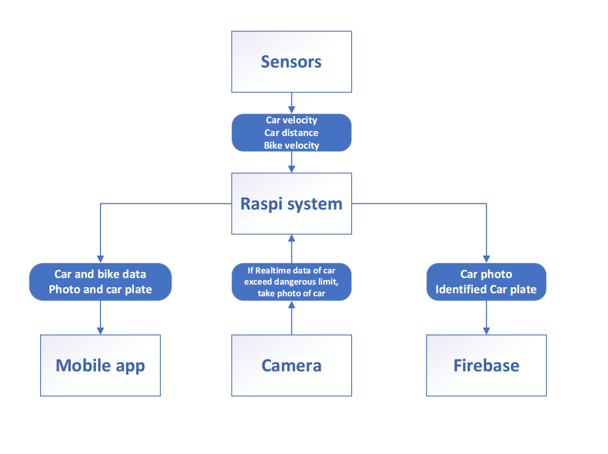

## System Overview
 

  
   
  <b> System Diagram </b>    

### Raspberry Pi:
The system’s core processing platform, which handles communicating with sensors\camera\mobile app and firebase, it will trigger the action for each part of the system whenever the driven event take place.

### Sensors
Two set of sensors that measure the speed of bike, the distance and speed of incoming car. And forward all those to raspberry Pi.
	
### Mobile app
User interface on mobile phone that shows the biker real time data of the bike and incoming car, also shows dangerous car photo and their car plate number.
	
### Camera
Pi camera that took picture whenever the incoming vehicle exceeded preset dangerous threshold(speed and distance).
	
### Firebase
Online database that stores the car plate photo and car plate recognition result, along side with the dangerous car’s distance\speed towards the biker the moment the picture was token. Timestamp will be uploaded to database also for further usage such as submit report to local authority.
