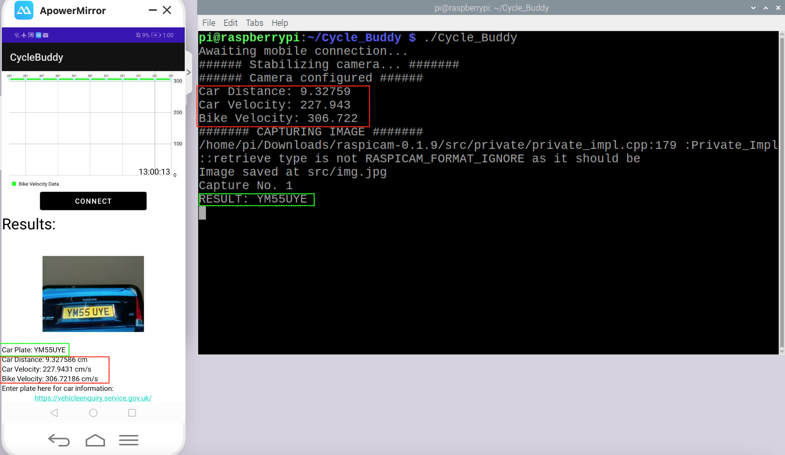

## Realtime Demo
### Short outdoor demo:
 

  <video width="600" controls>
    <source src="videos/outdoor-demo-fix1.mp4" type="video/mp4">
  </video>

 

### Outdoor and indoor Demo in the Youtube:
* Moral of the story is, that the api is capable enough to recognize the car plates within any environment. Moreover, the data displayed under the Car Plate are the sensor readings at the instant of capturing the image. Thus, ensuring that the system operates in real time.  

 <iframe width="560" height="315" src="https://www.youtube.com/embed/NPxJzn9jRe8" title="YouTube video player" frameborder="0" allow="accelerometer; autoplay; clipboard-write; encrypted-media; gyroscope; picture-in-picture" allowfullscreen></iframe>

 

* The final thing to notice is how the system saves the relevant data once the image is captured, reinforcing the idea of a real-time embedded system:

  
      
  <b>Result of the Realtime Demo</b>    

* Notice how the car plate is equivalent (green square), alongside car distance, velocity and bike velocity (red square).
  

