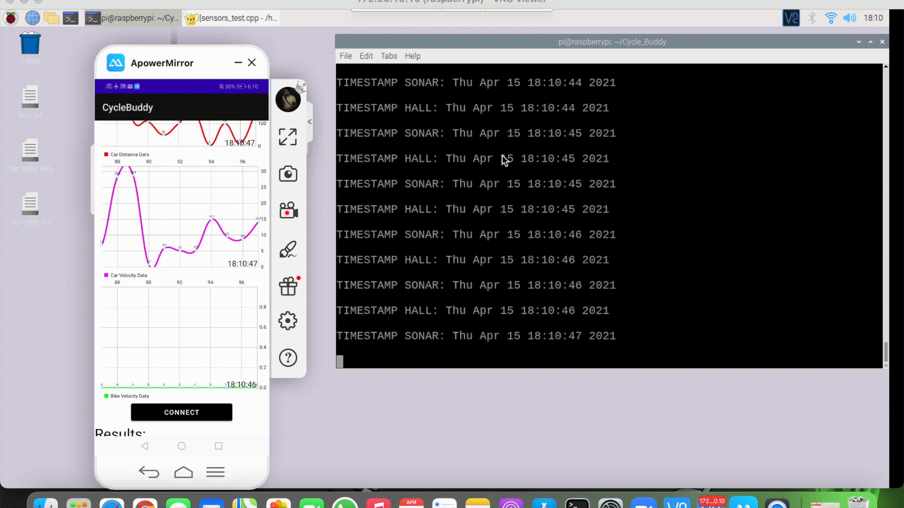

## Welcome to Cycle Buddy !

      
    
      
    ⭐️<a href="https://github.com/OmarJabri7/Cycle_Buddy"><strong>Explore Our Github»</strong></a>

We are a group of the Real Time Embedded Programing Project in the University of Glasgow.  Two members major in Robotics & Ai, one member majors in Electronic and Electrical Engineering. 

Our project, Cycle Buddy, is a system that detects danger levels in bikers relative to drivers. Once a driver overpasses a biker, the system detects this unauthorised act, and responds by recognising the face/car plate of the driver in order to contact law enforcements.  

## Short demo about our project
 
The Gif below demonstrates the real time nature of the system, where each sensor reading is sent to the android application and plotted in real time:
  

    
          
    <b>Figure 2: Real time demo</b>    
  

  
* It is clear to note how the timestamp emerging from the raspberry pi is the same as the one displayed in the android app. This reinforces the real-time responsiveness of our system.
